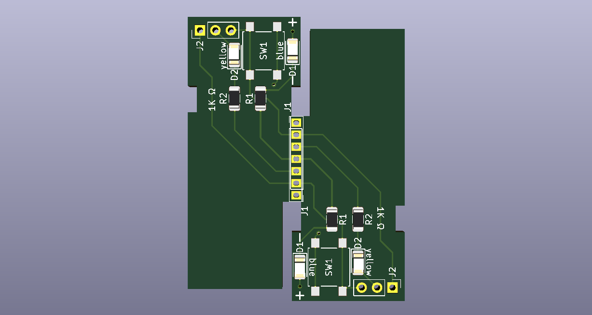

# Xiaomi2Ali Smart Plug WiFi Module

Xiaomi Smart Plug WiFi Module to Ali 86 Smart Plug Adapter board

此项目是把从[米家智能插座基础版](https://www.mi.com/mj-socket/)里拆卸下来的 WiFi 模块转换成可供阿里智能插座-86型墙壁插座使用的模块。

使用小米的 WiFi 模块替换原有阿里智能的 WiFi 模块，实现使用米家APP控制插座，并且支持小爱同学控制。

目前米家生态链里没有直接使用 WiFi 的86型墙壁智能插座。

支持阿里86型墙壁插座的 10A 与 16A 的 WiFi 模块兼容性。

发给 PCB 厂家生产时建议使用 [Rev.B](Gerber/Rev.B) 版本。
某些厂家可能不支持半孔覆铜工艺，可用 Rev.B 版本发给厂家去生产。
使用 Rev.B 生产的 PCB 需要自己在通孔焊盘上划一刀再掰开，有必要还可以用锉刀再打磨一下断裂处。

